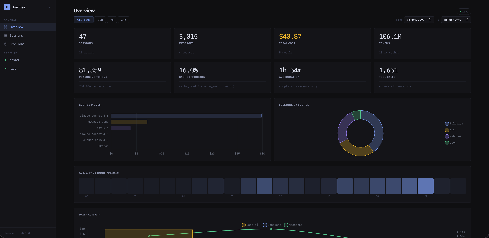
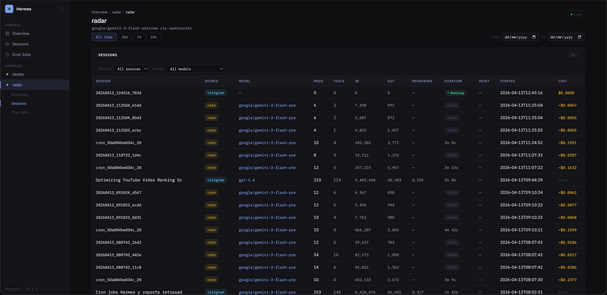
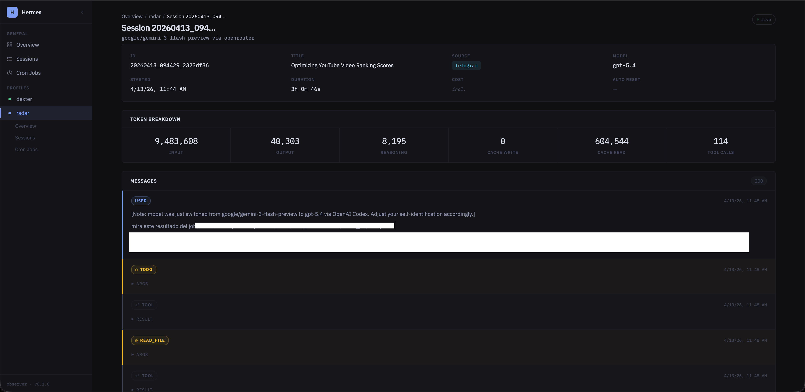
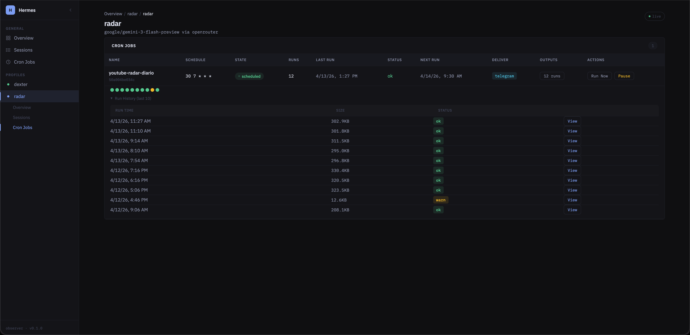

# hermes-controlplane

Hermes Control Plane is a sidecar/plugin open source for Hermes.

v0.1 focuses on one job: giving you a simple local dashboard and JSON API to observe an existing Hermes installation, plus safe cron operations that reuse the Hermes CLI.

What this release includes:
- read-only session and profile observation from Hermes state
- dashboard rendered on the server with FastAPI + Jinja2
- JSON API for sessions, overview metrics, profiles, and cron data
- cron visibility and cron actions from the UI
- host-native install with uv + systemd user service
- localhost-first deployment model

What this release does not include:
- raw profile config viewer/editor
- built-in auth inside FastAPI
- Docker as the official deployment path
- landing page or marketing site

## Screenshots

<!-- Replace the placeholder files in docs/screenshots/ with real captures.
     Recommended format: PNG, ~1400px wide, clean data (no sensitive info). -->

### Overview


[](https://app.fossa.com/projects/git%2Bgithub.com%2Fmatiasdaloia%2Fhermes-controlplane?ref=badge_shield)
*Global KPIs, session metrics, and activity charts.*

### Sessions


*Filterable and paginated view of all agent sessions.*

### Session Detail


*Full message history, token breakdown, and model usage for a single session.*

### Cron Jobs


*Cron job visibility with run/pause/resume actions directly from the UI.*

## License

MIT. See [LICENSE](LICENSE).


[](https://app.fossa.com/projects/git%2Bgithub.com%2Fmatiasdaloia%2Fhermes-controlplane?ref=badge_large)

## Security model

Official posture for v0.1:
- bind to `127.0.0.1`
- access remotely through SSH tunnel by default
- Tailscale is a good advanced option when you already use it
- direct public internet exposure is not recommended
- no custom auth layer is shipped inside the app

More details: [SECURITY.md](SECURITY.md).

## Platform support

Officially supported in v0.1:
- Linux
- `systemd --user`
- `uv`

Also works for manual local development on:
- macOS

Current installer scope:
- `./install.sh install` is Linux-only because it installs a `systemd --user` service
- `./install.sh uninstall` is also Linux-only for the same reason
- on macOS, use the manual run instructions instead of the service installer

## Quick start

Requirements:
- Python 3.11+
- `uv`
- `systemd --user` for the official service install path
- local access to a Hermes home directory

Fast path:

```bash
git clone <your-fork-or-local-copy>
cd hermes-controlplane
./install.sh install
```

The installer:
- creates or updates `.env`
- runs `uv sync`
- installs a user service
- starts `hermes-controlplane.service`

To uninstall the service later:

```bash
./install.sh uninstall
```

Then open locally:
- `http://127.0.0.1:8780`

## Manual host-native install

See [docs/install-host-native.md](docs/install-host-native.md).

Short version:

```bash
uv sync
cp .env.example .env
uv run uvicorn hermes_controlplane.main:app --host 127.0.0.1 --port 8780
```

## Remote access

Recommended:

```bash
ssh -L 8780:127.0.0.1:8780 your-user@your-server
```

Then open:
- `http://127.0.0.1:8780`

Advanced option:
- run it behind Tailscale on a trusted tailnet
- still keep the app bound to localhost unless you know exactly why you need otherwise

## Configuration

Copy [.env.example](.env.example) to `.env` and adjust if needed.

Main variables:
- `HERMES_HOME=${HOME}/.hermes`
- `CONTROLPLANE_HOST=127.0.0.1`
- `CONTROLPLANE_PORT=8780`
- `CONTROLPLANE_LOG_LEVEL=info`

## Project docs

- [docs/install-host-native.md](docs/install-host-native.md)
- [docs/architecture.md](docs/architecture.md)
- [docs/cron.md](docs/cron.md)
- [CONTRIBUTING.md](CONTRIBUTING.md)
- [SECURITY.md](SECURITY.md)

## Development

Run tests:

```bash
uv run pytest -q
```

Run locally without installing the service:

```bash
uv run uvicorn hermes_controlplane.main:app --host 127.0.0.1 --port 8780 --reload
```

## Contributing

External contributions are welcome. Start with [CONTRIBUTING.md](CONTRIBUTING.md).